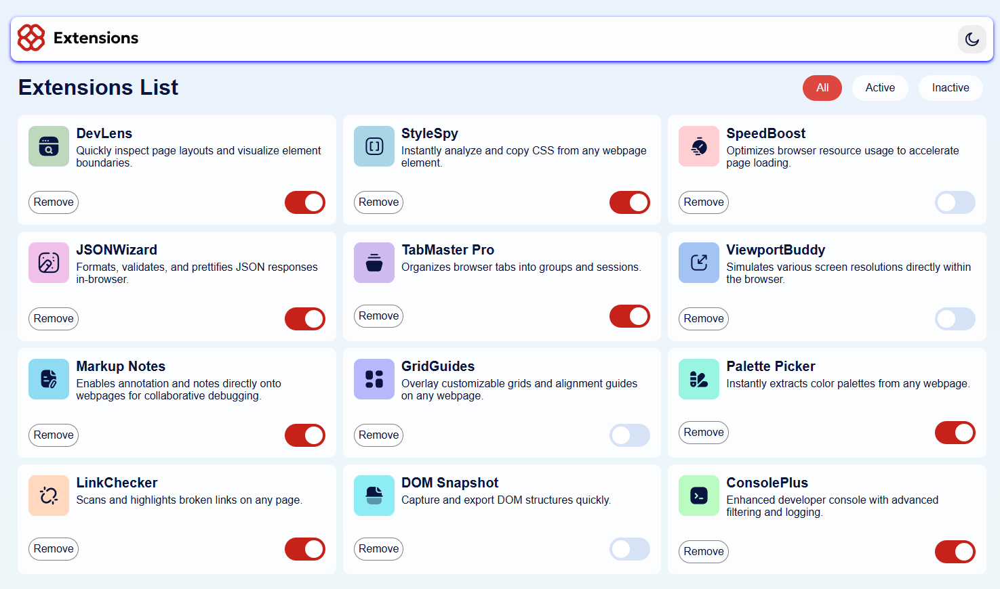
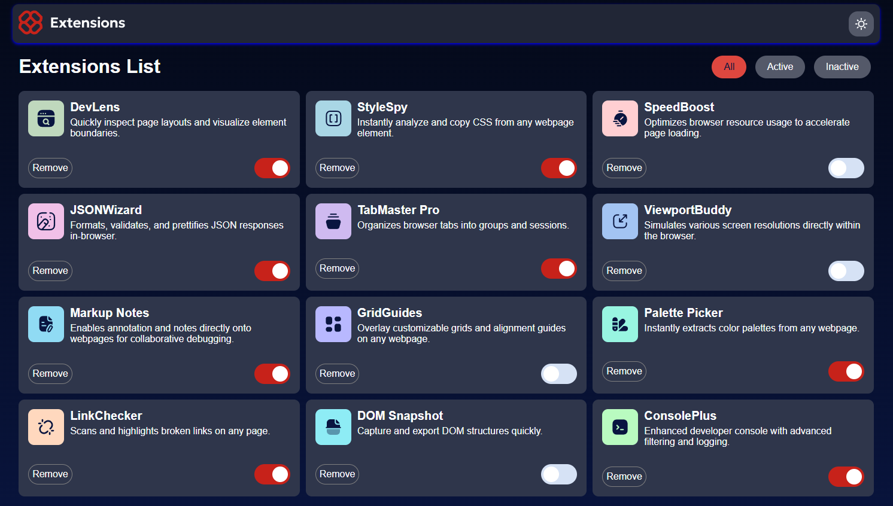

# Frontend Mentor - Browser extensions manager UI solution

This is a solution to the [Browser extensions manager UI challenge on Frontend Mentor](https://www.frontendmentor.io/challenges/browser-extension-manager-ui-yNZnOfsMAp). Frontend Mentor challenges help you improve your coding skills by building realistic projects.

## Table of contents

- [Overview](#overview)
  - [The challenge](#the-challenge)
  - [Screenshot](#screenshot)
  - [Links](#links)
- [My process](#my-process)
  - [Built with](#built-with)
  - [What I learned](#what-i-learned)
  - [Continued development](#continued-development)
  - [Useful resources](#useful-resources)
- [Author](#author)

**Note: Delete this note and update the table of contents based on what sections you keep.**

## Overview

### The challenge

Users should be able to:

- Toggle extensions between active and inactive states
- Filter active and inactive extensions
- Remove extensions from the list
- Select their color theme
- View the optimal layout for the interface depending on their device's screen size
- See hover and focus states for all interactive elements on the page

### Screenshot

### Links

- Solution URL: [Add solution URL here](https://your-solution-url.com)
- Live Site URL: [Add live site URL here](https://your-live-site-url.com)

## My process

### Built with

- Semantic HTML5 markup
- CSS custom properties
- JavaScript

**Note: These are just examples. Delete this note and replace the list above with your own choices**

### What I learned

[EN] For this project, I learned how to do a darkmode and how to change the elements when it is activated.

[FR] Pour ce projet, j'ai appris comment faire un mode sombre (darkmode) et comment changer les éléments quand il est activé.

**Note: Delete this note and the content within this section and replace with your own learnings.**

### Continued development

[EN] In the future, I'd like to improve my skills in JS for a future job or create web sites.

[FR] À l'avenir, j'aimerais améliorer mes compétences en JS pour un futur travail ou créer des sites.

**Note: Delete this note and the content within this section and replace with your own plans for continued development.**

### Useful resources

- [Resource for the switch button](https://www.w3schools.com/howto/howto_css_switch.asp) - This helped me for coding the switch button.
- [Resource for the darkmode](https://www.youtube.com/watch?v=_gKEUYarehE) - A tutorial of how to create a darkmode in JS.

**Note: Delete this note and replace the list above with resources that helped you during the challenge. These could come in handy for anyone viewing your solution or for yourself when you look back on this project in the future.**

## Author

- Frontend Mentor - [@clementD99](https://www.frontendmentor.io/profile/clementD99)
- Github - [@clementD99](https://github.com/clementD99)

**Note: Delete this note and add/remove/edit lines above based on what links you'd like to share.**
